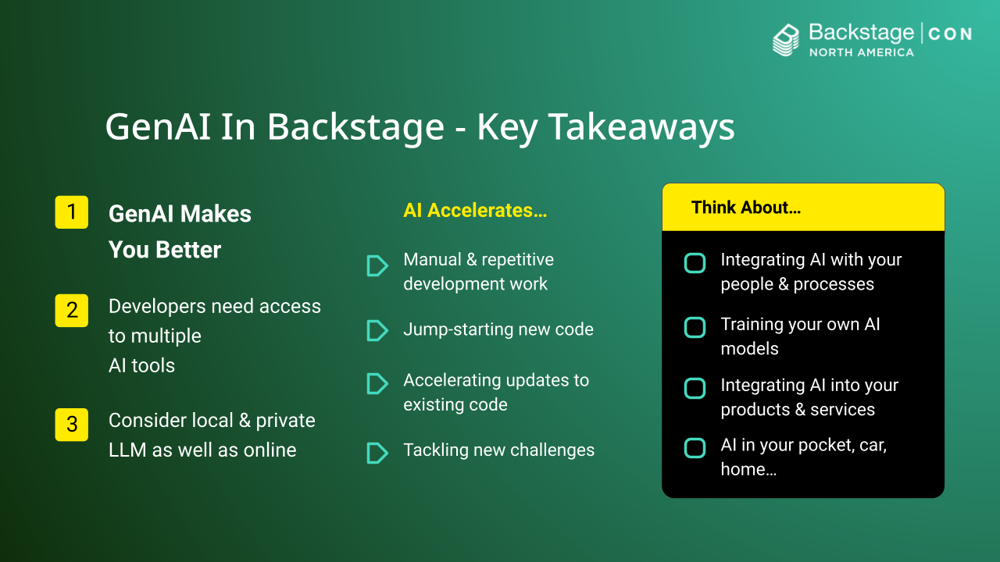

# Full talk | Generative AI in Backstage - Turbocharge Your Developer Productivity!

## BackstageCon 2023
9:50am November 6th, Chicago, USA  

## Links

- [Backchat Plugin GitHub Repo](https://via.vmw.com/backchat)
- [BackstageCon Slides](https://via.vmw.com/bsc-talk)
- [BackstageCon Talk GitHub Repo](https://via.vmw.com/bsc-repo)(AI Servers, Catalog, TechDocs, Notes etc.)

## Introduction

Backstage provides a powerful developer platform, but integrating the latest AI capabilities can take it to the next level.  

In this talk, we'll explore how to leverage large language models like ChatGPT within Backstage to automate routine tasks, generate code, find answers, and boost developer productivity.

In this talk, you’ll learn how to use off-the-shelf open-source components to add a ChatGPT facility into Backstage, switch between different large language models, and prompt the LLM to deliver better responses.

## The Benefits Of Generative AI

### Introduction

You all know how incredible backstage is at boosting your productivity. You can find answers quickly, share knowledge like never before, and navigate quickly to the things you need.

But, there’s a new productivity slayer in town - Generative AI - and the hype cycle’s in full swing. Today I want to show you why you should offer GenAI to your developers, how you can experiment with it safely in Backstage, and share some tips to help you become an AI boss

My name is Ben Wilcock, I work in Technical Marketing, and I’m nuts about Backstage and GenAI.

### First, How Good Is GenAI At Boosting Productivity?

Check out this recent study by [Harvard Business School and Boston Consulting Group](https://www.hbs.edu/faculty/Pages/item.aspx?num=64700) (September 2023)

- 758 BCG knowledge workers took part in the study  
- 3 phases - enroll, experiment, exit interview
- Some were given AI training, some were not
- 2 tasks, one creative and one problem solving with data
- 2 experiment runs, one with AI and one without  
- Tests marked by humans and by AI

The results were astonishing:

- All knowledge workers benefited from AI augmentation...  
- High performers saw a 17% improvement
- Lower performers saw a 43% improvement

For tasks the AI is good at (writing, analyzing data, creativity (e.g. prototyping)...

- Workers completed 12% more tasks
- Workers finished 25% faster

In summary: Knowledge workers using AI saw significant benefits in **productivity, quality, and speed** when applying AI to tasks the AI is good at.

### What Are The Benefits for Software Developers?

OK, but that’s for “knowledge workers.” What about software developers?

[McKinsey](https://www.mckinsey.com/~/media/mckinsey/business%20functions/mckinsey%20digital/our%20insights/unleashing%20developer%20productivity%20with%20generative%20ai/unleashing-developer-productivity-with-generative-ai.pdf?shouldIndex=false) recently ran a study with developers: (June 2023)

- 40 developers with varying experience took part
- Each assigned common software development tasks in 3 areas - code generation, refactoring, and documentation.
- Each task was done by a test group with access to 2 generative AI tools (one general AI, one code specific AI) and a control group without access to any AI

The results were impressive:

1. Faster task completion - **20-50% faster** on average 
2. **25-30% more likely** to complete a task within a deadline
3. Four areas in particular saw “tremendous” gains:
   - a. Expediting manual and repetitive work
   - b. Jump-starting the first draft of new code  
   - c. Accelerating updates to existing code
   - d. Increasing developers’ ability to tackle new challenges

Those using multiple AI tools saw additional time improvements of 1.5-2.5x, suggesting greater AI access can further boost productivity.

### Are There Benefits for Software Development Managers?

Yes. Besides code, there are other benefits too...

**Fewer bugs.**  
Having AI help diagnose and fix errors could help reduce technical debt and improve customer satisfaction.  
The Harvard / Boston study found that when AI was used, quality was 40% higher  
AI tools like Snyk’s Deepcode.ai even work proactively - identifying and correcting potential bugs before they reach users.

**Better testing and documentation.**  
Test generation and higher code coverage leads to fewer defects and regressions.  
Better documentation reduces cognitive load, improves team efficiency. Time was always our main problem - AI helps alleviate time pressure!

**Better planning & products.**  
AI can act as an effective sounding board, helping managers to allocate resources more effectively.  
Including AI features in your products helps you meet users' shifting expectations.

**Improved developer experience.**  
Allowing developers access to effective AI tooling can reduce stress levels, limit burnout, increase knowledge, and increase retention and net-promoter scores. Great news for your personal promotion prospects!  
McKinsey study revealed developers were 2x happier and reported better personal fulfillment & accelerated entry to “flow” states.  

**Faster modernization.** AI’s ability to translate code between programming languages and replace lost skills could turbocharge your approach to application modernization.  
Mckinsey: The use of generative AI is cutting down cloud migration efforts by 30-50% when done correctly. - The Register

### In Summary

To reach maximum effectiveness, developers need access to more than one AI. 

McKinsey study found that: access to a general AI and a code specific AI works best.

### You Should Think about...

- Using an AI in within IDEs for help with coding tasks (e.g. Copilot, Tab9, VMware SafeCoder etc.),
- Using an AI outside the IDE (like Mistral, LLama2, ChatGPT etc.) for ancillary and supporting tasks.

## Some Issues With Generative AI 

### Think Very Carefully Before Choosing “Online” AI  

[Gartner](https://www.gartner.com/en/articles/set-up-now-for-ai-to-augment-software-development): “The use of SaaS large language model offerings, such as ChatGPT and Google Bard, requires a number of trade-offs that many enterprises will find unacceptable.”

### Privacy.

Public AI’s can remember your prompts and leak information. 

[TechRadar](https://www.techradar.com/news/samsung-workers-leaked-company-secrets-by-using-chatgpt): “Samsung workers have unwittingly leaked top secret [code for chip testing] whilst using ChatGPT. In just under a month, there were three leaks [of] sensitive information via ChatGPT. Since ChatGPT retains user’s prompts to further train itself, these trade secrets from Samsung are now effectively out in the [open]” - Samsung are now thinking about building a private in-house AI - The Economist

API keys accidentally exposed have also been extracted from the training data used by IDE tools like Copilot and CodeWhisperer - [The Register](https://www.theregister.com/2023/09/19/github_copilot_amazon_api/)

Because LLMs are so complex and non-deterministic, recent attempts to make AI’s forget information they’ve been given havn’t been terribly successful. 

Even state-of-the-art model editing methods, such as Rank-One Model Editing “fail to fully delete factual information from LLMs, as facts can still be extracted 38% of the time by whitebox attacks and 29% of the time by black box attacks.” - [Patil, Hase, Bonsal - UNC Chapel Hill](https://arxiv.org/pdf/2309.17410.pdf)

### Sustainability.

The rapid expansion of big tech AI is causing environmental stress. The [growing energy footprint](https://www.cell.com/joule/fulltext/S2542-4351(23)00365-3?_returnURL=https%3A%2F%2Flinkinghub.elsevier.com%2Fretrieve%2Fpii%2FS2542435123003653%3Fshowall%3Dtrue) and [water consumption](https://fortune.com/2023/09/09/ai-chatgpt-usage-fuels-spike-in-microsoft-water-consumption/) in cooling is a particular concern. 

Think about your needs carefully. “you don't need a 65 billion parameter model to generate customer support scripts” - [McKinsey partner Bhargs Srivathsan](https://www.theregister.com/2023/10/11/generative_ai_cloud_migration/)

### Accuracy.

The [McKinsey State of AI in 2023 report](https://www.mckinsey.com/capabilities/quantumblack/our-insights/the-state-of-ai-in-2023-generative-ais-breakout-year#/) found that the #1 AI-related risk that organizations consider relevant is inaccuracy. This problem can be difficult to mitigate for and have severe unintended consequences.

### Licencing & Copyright.

AI tools are pre-trained on lots of data scraped from the internet. Tracing knowledge back to their source is extremely challenging. Many are wary of the legal risks where generating content is accidentally based on protected content. And, in the US, Content generated by AI cannot be legally protected under current copyright law.

## Safely Adding AI Chatbots Into Backstage

Considering what we’ve seen, adding private, secure and local AI to Backstage is a great place to start experimenting with generative AI. Here’s my personal proof of concept (but I’m sure you can do better).

### DEMO: The Backchat Plugin

This simple proof of concept integrates private and secure AI chatbots into Backstage using a plugin. 

[Show the architecture - Backstage Software Catalog]

### Private, Open-Source AI Tools provide the backend

These open-source tools and libraries provide Backchat’s backend.

- LocalAI/ChatbotUI or  
- TG WebUI plus
- OSS LLM models (e.g. Mistral, OpenInstruct etc.)

Locally hosted open source LLMs are growing in popularity

- Your prompts, sensitive data, and responses remain private  
- You can even [re]train them on your own data
- You can run them sustainably and at the edge
- You don’t need an account, credit card, or API keys

Smaller local LLMs can run almost anywhere.

- With or without a GPU (laptop, desktop, workstation, VM)
- Modest RAM requirements (e.g. No VRAM)
- Shutdown when not in use
- Getting faster all the time...

### DEMO: Backchat In Action

A quick, high-level demonstration of using this private and secure chatbot within Backstage.

## Tips For Using Generative AI 

The use of generative AI can altogether succeed or fail based on the prompt that you enter. Here are some things to consider and try.

### Prompt using ”Roles”, “Situations” and “Tasks”

Prompt the AI to take on the ROLE of a knowledgeable person

Give guidance on the SITUATION where the query is relevant  

Be specific about the TASK to be performed

“You are a database designer with expert knowledge of SQL. You work for a company that manages fleets of vehicles for businesses. Create a database that will hold information on vehicles and their owners. A vehicle belongs to one owner, but an owner can own many vehicles.”

### Improve the quality and accuracy using “Chain-of-Thought” prompting

Step-by-step is a valuable technique

Helps prevent “jumping to conclusions” by showing your working out

“Let’s think step by step” “Check your answer”

### Show me vs tell me?

“Show me / Show it” usually means to demonstrate using examples, so the AI may answer in this way. You can also prompt the AI using an example as a way to convey more meaning by providing an example of the expected output.  

“Tell me / Tell it” usually means via a set of steps and laid out instructions. This could be in the expected response, or in the prompt by providing instructions on key aspects of how the task should be completed.

**Show me:**

- Provides an example demonstration of the desired output format and style
- Shows rather than tells what the end result should look like  
- Avoids giving detailed instructions
- Relies on the AI inferring criteria from the example

**Tell me:**

- Gives explicit instructions for how to complete the task
- Provides clear steps and criteria for the output
- Tells the AI what to do rather than showing it
- May not include any examples for the AI to follow

Try both.

### Reusing the “Context” (few-shot) for repetitive work 

Movie 1: “A young halfling is given a magic ring which holds a great but corruptive power. He must travel with his friends through a mystical land to the one place where the ring can be destroyed.” Genre: “Fantasy

Movie 2: “In a galaxy far, far, away, an orphaned moisture farmer embarks on an epic quest to return a second hand droid to its vulnerable owner. The droid contains a secret plan that could help destroy the evil empire’s biggest weapon and which puts him and his fellow adventurers in great danger.” Genre: Science Fiction

Etc...

Now, ask the model to classify additional movies from their description

Repeat...

Prompt 1: 
"A New Hope introduced iconic characters like Luke Skywalker and Darth Vader while captivating audiences with epic space battles."

Prompt 2:
"The Empire Strikes Back featured shocking twists and darker themes as the Rebels are pursued by the Empire."

Please write a 1-2 sentence summary in the same style summarizing the key points of Return of the Jedi.

## Some Use Cases and Examples

Here are some examples of where chat can be really useful:

### Databases

Tell me the steps needed to create a database that holds the details of vehicles and their owners. In the database, a vehicle can belong to only one owner but an owner can own many vehicles. Use the SQL language to create the database, its tables, and the relationships between them. Explain each step showing the SQL required.

### Testing 

You are a quality assurance tester and an expert in JUnit testing. Write the code required to test the following Java method using JUnit. Add positive and negative tests. Think through the problem carefully, step by step.

```java
public String fibonacciSequence(int n) {
  int[] a = new int[n];
  a[0] = 0; 
  a[1] = 1;
  for (int i = 2; i < n; i++) {
    a[i] = a[i-1] + a[i-2];
  }
  return Arrays.toString(a);
}
```

### Operations

You are an IT systems operator and an expert in Kubenetes platform management. I need to deploy an NGINX server to my Kubernetes cluster. Show me all the configuration needed to deploy the NGINX server as a Kubernetes service. Include the pod, deployment, replicaset, and service details.The service should be reliable - able to handle both load and failures.

### Documentation

You are a creative technical writer and an expert with JavaDoc. Take a look at the following java method.

```java
public String fibonacciSequence(int n) {
  int[] a = new int[n];
  a[0] = 0;
  a[1] = 1;
  
  for (int i = 2; i < n; i++) {
    a[i] = a[i-1] + a[i-2];
  }
  
  return Arrays.toString(a); 
}
```

Add the JavaDoc required to fully describe what the method does. Your JavaDoc should be descriptive and verbose. Include details the reader will find fascinating. Think carefully and check your answer.

### Designing

You are a focus group consisting of 10 randomly selected car users. 20% of the users are young adults, 40% of the users are middle aged, and 40% of the users are retired. I am a software designer designing a new automotive software product to be used inside a car. Should I design the software to have multiple GUI themes and characters like "foxes" or "eggheads" or should I design the software to be plain and functional with no themes or characters? Come to a decision as a group and give me your answer.

### Research

How many Java coders are there?

If I am creating a new software application, is Java a good choice of language? 

What about games? Are there many games written in java? How does Java compare to other languages when writing games?

### Technical writing

You are a database expert. I am a technical writer working on database documentation used by people who are new to the SQL language. Explain to me what the SQL "JOIN" command is used for. Show an example of a vehicles table and an owners table being joined. Show the results of the JOIN in a table.

### Team Work (360 feedback :)

I am a colleague of Bob and I need to contribute some thoughts to his 360 degree evaluation form. Bob is fantastic at coding and works well with his peers. Bob and I are friends and have a good rapport. Bob has told me would like to become a leader someday, but Bob is quite introverted and struggles to take the lead effectively in group situations. Help me to write some advice for Bob. Offer him encouragement and practical tips that might help him increase his effectiveness as a leader. Be concise.

### Creating data (e.g. JSON)

Show me how to write a JSON file that describes three people. For each person include attributes such as their id, first name, last name, age, eye color, country of residence, and date of birth (in YYYY-MM-DD format). Use markdown in your response.

### Working with unfamiliar languages or frameworks.

You are an expert in the Python programming language. I do not know Python at all. When creating new Python applications, which frameworks might help me work faster and reduce the complexity of my code? Give your reasoning for each suggestion and explain why they might be worth further investigation.

## Takeaways



!!! info "Key Takeaways"

    - Give developers access to more than one AI
    - Consider local private LLM options as well as big names
    - Think about using AI for:
      - Manual and repetitive development work
      - Jump-starting the first draft of new code
      - Accelerating updates to existing code
      - Increasing developers’ ability to tackle new challenges
      - Modernization
    - Think about your next steps:
      - Integrating AI into your processes
      - Re-training your own AI models (MLOps)
      - Integrating AI into your products & services
      - AI in your pocket, car, home...