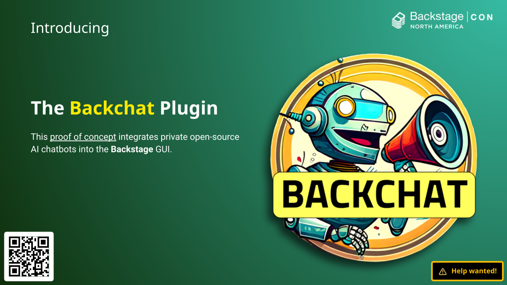
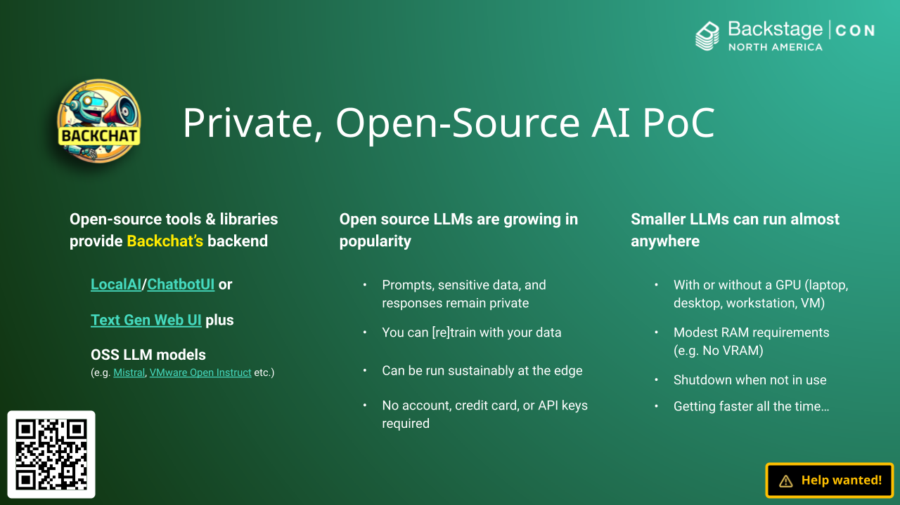
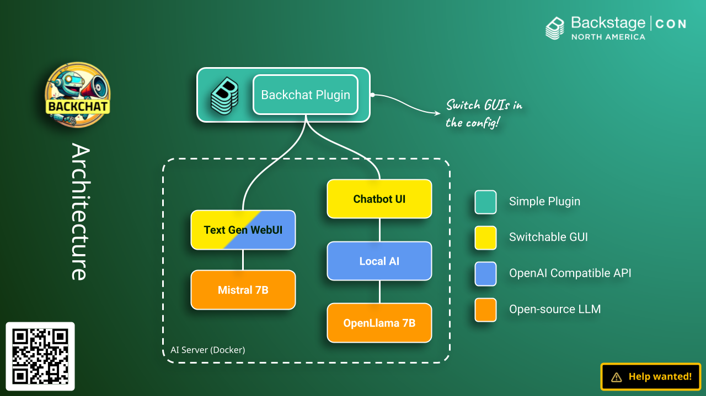
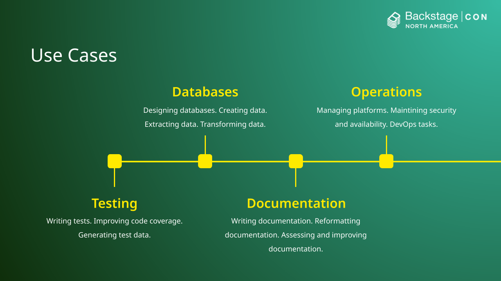
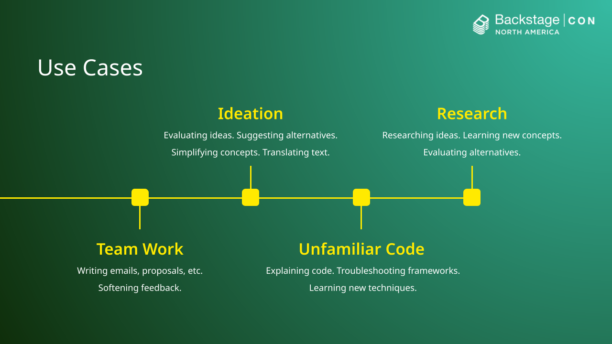

I created the Backchat plugin as a **proof of concept**. The goal was to give Backstage users a flavor of what it might be like to use generative AI from within the Backstage GUI. This prevented the need to for me to leave Backstage to visit external AI tools and helped keep me productive.

## Benefits

In the process of building this proof of concept I realized that there is always going to be a need for private AI options and flexibility when it comes to which large language models an organization wants it's developers to use (and possibly train). If you share this vision, why not contribute?

!!! warning "Work In Progress"
    Help wanted.

## Architecture

Thanks to it's simplicity, Backchat is very flexible. You can use any chat GUI you like at this stage.

## Use Cases

There are a number of reasons why it could be helpful for developers to have access to an AI in Backstage. Here is just a selection of the potential use cases where access to generative AI could boost your productivity.

## Roadmap

What I'd really like to do is transform this Backchat plugin into a fully integrated open-source OpenAI API client for Backstage, but I need your help! Interested? Contact me directly on [LinkedIn](https://www.linkedin.com/in/benwilcock/) or GitHub if you'd like to contribute!